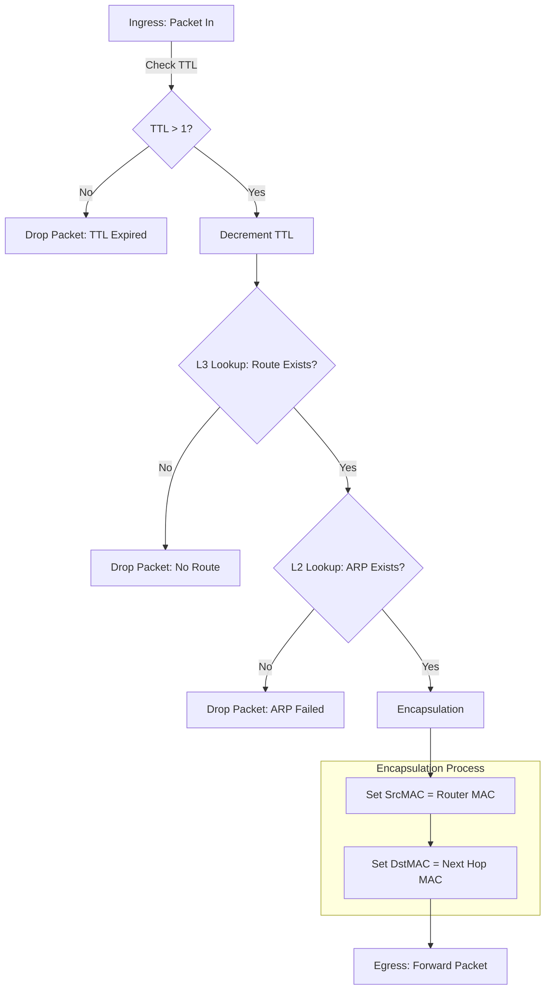

# Mini Router Simulator

A C++ project that simulates a **Layer 3 Router** using Object-Oriented Programming (OOP).
It emulates **packet forwarding** with a complete **TCP/IP lifecycle**, including **TTL aging**, **routing table lookup**, **ARP resolution**, and **Layer 2 encapsulation**.

This project demonstrates system-level networking concepts and modular C++ design.

### Features

  * **Packet Structure** — simulates real network packets with Layer 3 (IP, TTL) and Layer 2 (MAC) headers.
  * **TCP/IP Lifecycle Management** — implements **TTL (Time-To-Live) aging** to prevent routing loops.
  * **Encapsulation** — simulates **Layer 2 header rewriting** (Source/Destination MAC updates) at each hop.
  * **Routing Table** — stores Destination IP → Next Hop IP mappings (Layer 3).
  * **ARP Table** — stores IP → MAC address mappings (Layer 2).
  * **Modular OOP Design** — separate classes for Router, Tables, and Packet structures.

### Packet Flow & Encapsulation Logic

The simulator processes a `Packet` object through the following lifecycle stages:



**System-Level Operations Simulated:**

1.  **Validation & Aging:** Checks if the packet is valid; decrements `TTL` (Time-To-Live).
2.  **Routing (L3):** Determines the next hop IP based on the destination.
3.  **Encapsulation (L2):** Rewrites the Ethernet header:
      * **SrcMAC** becomes the Router's MAC.
      * **DstMAC** becomes the Next Hop's MAC.

### Example Output

```text
=== Test Case 1: Normal Forwarding ===

[Router] Ingress: Packet destined for 10.0.0.2
         Current TTL: 64
-> L3 Routing Decision: Next hop is 192.168.1.1
[Forwarding] Packet forwarded successfully!
             L2 Header Updated -> SrcMAC: AA:BB:CC:DD:EE:01 | DstMAC: AA:BB:CC:DD:EE:01
             L3 Header Updated -> TTL: 63

=== Test Case 2: TTL Expired (Lifecycle Simulation) ===

[Router] Ingress: Packet destined for 10.0.0.9
         Current TTL: 1
x Dropped: TTL expired (Lifecycle ended).

=== Test Case 3: No Route ===

[Router] Ingress: Packet destined for 10.0.1.1
         Current TTL: 64
x Dropped: No Route found for 10.0.1.1
```

### Build & Run

Ensure you have a C++17 compatible compiler (e.g., `g++` or `clang++`).

```bash
# Compile the project
make

# Run the simulator
make run

# Clean build files
make clean
```

### Learning Goals

  * **Emulate Packet Forwarding:** Implemented a simulator that handles packet objects rather than simple strings.
  * **TCP/IP Lifecycle:** Applied **TTL logic** to simulate packet aging and network loop prevention.
  * **Encapsulation:** Practiced **system-level operations** by rewriting Layer 2 headers (MAC addresses) during forwarding.
  * **Network Layering:** Clear separation between **Layer 3 (IP Routing)** and **Layer 2 (ARP/Mac)** logic using OOP.
  * **C++ Proficiency:** Utilized structs, classes, and standard libraries to build maintainable network code.